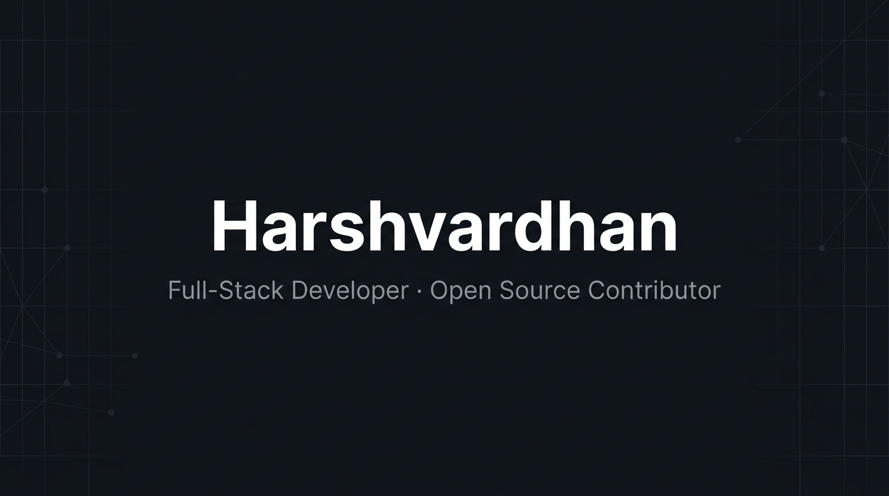

 

---

B.Tech undergrad at **NIT Jalandhar** building full-stack applications and contributing to open source. I work across the stack with React, Node.js, TypeScript, and cloud-native tools — focused on shipping products that solve real problems.

Open to **freelance work, internships, and collaborations**.

---

### Stack

**Languages**

  

**Frontend**

  

**Backend & Database**

  

**DevOps & Cloud**

  

**Tools**

  

---

### Now

- Building full-stack SaaS products and open-source tools
- Learning GenAI, DevOps pipelines, and microservices patterns
- Contributing to open-source projects and cloud-native ecosystems

---

 

  

